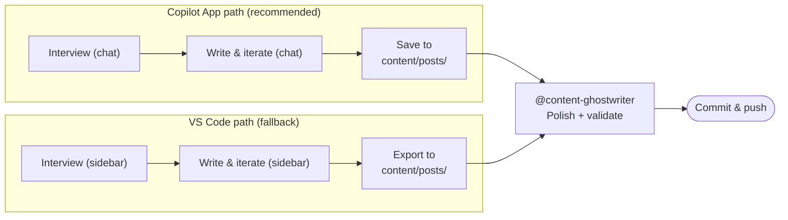
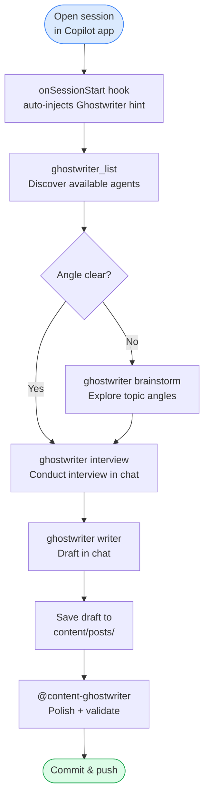
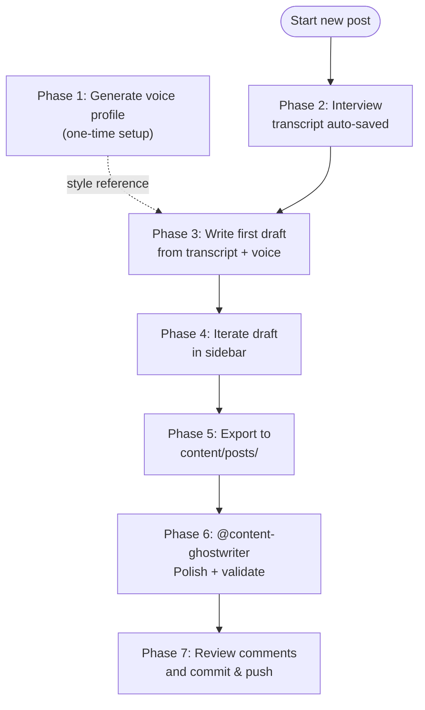

# Content creation

This site uses a **hybrid content creation approach** that pairs AI-assisted Ghostwriter writing agents with a custom Copilot agent (`@content-ghostwriter`) for post-processing. The writing agents handle the creative phase (brainstorming, interviewing, drafting); the finishing agent handles the mechanical phase (validation, formatting, link checking, build verification).

Two paths lead to the same pipeline. The Copilot App path is the recommended starting point:

- **Copilot App path** _(recommended)_ — a [Ghostwriter extension bridge](.github/extensions/ghostwriter/extension.mjs) registers writing agents as chat tools (`ghostwriter`, `ghostwriter_list`) inside the Copilot app. No sidebar, no extra window — the full workflow runs in the chat.
- **VS Code path** _(fallback)_ — the [Ghostwriter for VS Code](https://marketplace.visualstudio.com/items?itemName=eliostruyf.vscode-ghostwriter) extension provides a dedicated sidebar with interview, writing, and draft-iteration modes. Choose this when you need persistent transcript files or a draft revision history.

Both paths converge once a draft lands in `content/posts/`: the `@content-ghostwriter` agent validates and formats it for publication.

## Table of contents

- [Philosophy](#philosophy)
- [Prerequisites](#prerequisites)
- [Which approach?](#which-approach)
- [Copilot App workflow](#copilot-app-workflow) _(recommended)_
  - [Phase A — Discover available agents](#phase-a--discover-available-agents)
  - [Phase B — Brainstorm (optional)](#phase-b--brainstorm-optional)
  - [Phase C — Interview in chat](#phase-c--interview-in-chat)
  - [Phase D — Write and iterate in chat](#phase-d--write-and-iterate-in-chat)
  - [Phase E — Save, polish, and publish](#phase-e--save-polish-and-publish)
- [VS Code workflow (fallback)](#vs-code-workflow-fallback)
  - [Phase 1 — Generate a voice profile (one-time setup)](#phase-1--generate-a-voice-profile-one-time-setup)
  - [Phase 2 — Interview](#phase-2--interview)
  - [Phase 3 — Write a first draft](#phase-3--write-a-first-draft)
  - [Phase 4 — Iterate on the draft](#phase-4--iterate-on-the-draft)
  - [Phase 5 — Save to workspace](#phase-5--save-to-workspace)
  - [Phase 6 — Polish with the content-ghostwriter agent](#phase-6--polish-with-the-content-ghostwriter-agent)
  - [Phase 7 — Final review and publish](#phase-7--final-review-and-publish)
- [Tool reference](#tool-reference)
  - [Ghostwriter extension bridge](#ghostwriter-extension-bridge)
  - [Content-standards skill](#content-standards-skill)
  - [Ghostwriter for VS Code](#ghostwriter-for-vs-code)
  - [Content-ghostwriter agent](#content-ghostwriter-agent)
- [Frontmatter schema](#frontmatter-schema)
- [Ghostwriter file structure](#ghostwriter-file-structure)
- [Version control considerations](#version-control-considerations)
- [Tips](#tips)

---

## Philosophy

AI-assisted writing works best when the AI acts as an **interviewer**, not a ghostwriter. The goal is to draw out _your_ knowledge, experiences, and opinions through conversation, then organise that raw material into a polished draft. The result sounds like you — because the source material literally is you.

This approach solves three problems at once:

1. **Blank-page syndrome** — the interview removes the pressure of starting from scratch.
2. **Authentic voice** — the draft is built from your answers, not generated from thin air.
3. **Speed** — you can produce a structured first draft in a fraction of the time it would take to write from scratch, without sacrificing quality.

Background reading: [Ghostwriter for VS Code: your AI interviewer in your editor](https://www.eliostruyf.com/ghostwriter-code-ai-interviewer-editor/) by Elio Struyf.

---

## Prerequisites

### Shared (both paths)

| Requirement                     | Notes                                                                 |
| ------------------------------- | --------------------------------------------------------------------- |
| **GitHub Copilot subscription** | Required for all AI features in both paths                            |
| **Node.js**                     | Needed for the polish step's build pipeline (`npm run build:content`) |

### VS Code path

| Requirement                                                                                                       | Notes                                                       |
| ----------------------------------------------------------------------------------------------------------------- | ----------------------------------------------------------- |
| **VS Code ≥ 1.108.1**                                                                                             | The extension requires this minimum version                 |
| **GitHub Copilot extension**                                                                                      | Must be installed and signed in                             |
| **[Ghostwriter for VS Code](https://marketplace.visualstudio.com/items?itemName=eliostruyf.vscode-ghostwriter)** | Install from the VS Code marketplace                        |

### Copilot App path

| Requirement                      | Notes                                                                                   |
| -------------------------------- | --------------------------------------------------------------------------------------- |
| **Ghostwriter extension bridge** | Already present in this repo at `.github/extensions/ghostwriter/extension.mjs`         |
| **Ghostwriter agents installed** | Run `npx @estruyf/ghostwriter --copilot` once — drops agents into `~/.copilot/agents/` |

---

## Which approach?

The **Copilot App path is the recommended default** — it requires no extra installation beyond running `npx @estruyf/ghostwriter --copilot` once, and the full writing workflow runs in the chat. Both paths use the same [ghostwriter-agents-ai](https://github.com/estruyf/ghostwriter-agents-ai) agents and converge at the same `@content-ghostwriter` polish step.



| Situation | Path |
| --------- | ---- |
| Default — no special requirements | **Copilot App** (recommended) |
| Quick brainstorm or exploratory draft | **Copilot App** — fast to start, no sidebar setup needed |
| Working exclusively in VS Code and want sidebar UX | **VS Code** (fallback) |
| You need persistent transcript files or draft revision history | **VS Code** (fallback) — auto-saves to `.ghostwriter/` |

> [!NOTE]
> The Copilot App path does **not** provide automatic transcript files, draft revision history, or a built-in resume flow. The conversation window is your working artifact — save it manually if you want to preserve it. When transcript persistence is critical, fall back to the VS Code path.

---

## Copilot App workflow

The Copilot App path uses the [Ghostwriter extension bridge](.github/extensions/ghostwriter/extension.mjs) — a lightweight ES module that registers the ghostwriter-agents-ai agents as chat tools. Unlike the VS Code path, there are no transcript files or draft revisions; the conversation itself is the working artifact.

> [!IMPORTANT]
> **Session-scoped behaviour:** activating an agent reprograms the LLM for the current session only. Closing the session resets to the default persona. Newly installed agents appear only in new sessions (the extension scans `~/.copilot/agents/` at startup). For a clean agent switch mid-session, opening a fresh session is the safest option.



### Phase A — Discover available agents

When you open any session in the Copilot app, the `onSessionStart` hook automatically injects a hint into the context. You can also call `ghostwriter_list` at any time to see what is installed.

**Example:**

```
You: What Ghostwriter agents can I use?

Copilot: [calls ghostwriter_list]

Ghostwriter agents available:

• brainstorm — Ghostwriter Brainstormer: Facilitates brainstorming sessions to
  explore ideas and generate actionable plans
• context   — Ghostwriter Context: Loads the current work-in-progress content
  to context for further commands
• interview — Ghostwriter Interviewer: Interviews an author to produce content
  (blog posts, articles, documentation, etc.)
• product-moral-compass — Ghostwriter Product Moral Compass: Guides developers
  through thoughtful decision-making before building software
• review    — Ghostwriter Reviewer: Reviews content against editorial guidelines
• voice     — Ghostwriter Voice: Analyzes the voice and tone of the user's
  writing to replicate it in generated text
• writer    — Ghostwriter Writer: Writes comprehensive, well-cited content
  based on a draft
```

> [!TIP]
> Run `npx @estruyf/ghostwriter --copilot` once to install the agents. Open a new session afterward — the extension scans the agents directory at startup, not dynamically.

### Phase B — Brainstorm (optional)

Use the `brainstorm` agent when you have a general topic but need to sharpen the angle before committing to an interview. Skip this phase when the scope is already clear.

**Example** — the following phases use this topic as a throughline:

```
You: Activate the brainstorm agent. I want to write about using GitHub Copilot
     in Power Platform ALM workflows, but I'm not sure what angle to take.

Copilot: [calls ghostwriter with agent: "brainstorm"]
[Ghostwriter: "Ghostwriter Brainstormer" activated]

Great topic. Let's map the angles:

1. The pragmatic guide — concrete steps: Copilot in solution export pipelines,
   PR reviews, deployment scripts. Best for practitioners already doing ALM.

2. The honest review — where Copilot genuinely helps and where it falls short
   in the Power Platform context. High credibility signal, opinion-driven.

3. The SRE lens — framing Copilot as a reliability tool: catching
   misconfigurations, reviewing Dataverse schema changes before they ship.
   Builds naturally on your existing SRE writing.

4. The cultural shift — how AI-assisted development changes expectations for
   low-code developers. Broader audience, less technical depth required.

Which angle fits the post you have in mind? Or should we combine a couple?

You: The honest review angle — I want to share what actually works and what
     does not, based on a year of using it in real projects.

Copilot: Good. That gives the post a strong credibility anchor. Let's move
         to the interview to extract the specifics.
```

### Phase C — Interview in chat

Activate the `interview` agent to conduct a structured interview. The AI will ask targeted questions to draw out your knowledge, experiences, and concrete examples — the same process as the VS Code sidebar interview, but entirely in the chat window.

**Example** — continuing from the brainstorm above:

```
You: Activate the interview agent.

Copilot: [calls ghostwriter with agent: "interview"]
[Ghostwriter: "Ghostwriter Interviewer" activated]

Let's dig into your honest take on GitHub Copilot in Power Platform ALM.
First question:

After a year of real-project use, what is the single most useful thing
Copilot does for you in a Power Platform ALM workflow — the thing you
would immediately miss if it disappeared?

You: Reviewing Dataverse schema changes in pull requests. I describe what
     I'm changing and why, and Copilot catches implications I missed —
     like a cascade effect on a plug-in or a calculated column I forgot about.

Copilot: That's a concrete, testable benefit. Follow-up: is there a scenario
         where Copilot gave you confident-sounding but wrong advice on a
         Power Platform artefact — something that could have gone to production?

You: Yes — it once suggested a solution component dependency that doesn't
     exist in the pac CLI schema. The suggestion looked plausible but would
     have broken the deployment pipeline silently.

[interview continues for several more exchanges...]
```

> [!NOTE]
> The conversation window is your transcript. If you want to preserve it, copy the exchange into a `.ghostwriter/transcripts/` file before closing the session.

### Phase D — Write and iterate in chat

Once the interview is complete, switch to the `writer` agent to produce the first draft. Iterate conversationally until the draft feels right.

**Example** — continuing from the interview above:

```
You: The interview is done. Activate the writer agent and write the article.
     Match the conversational but technically precise tone of my existing posts.

Copilot: [calls ghostwriter with agent: "writer"]
[Ghostwriter: "Ghostwriter Writer" activated]

Here is a first draft based on our conversation:

---
title: "GitHub Copilot in Power Platform ALM: an honest review after a year"
date: 2026-05-29
tags: [power-platform, alm, github, github-copilot, devops]
description: "An honest assessment of where GitHub Copilot genuinely helps
in Power Platform ALM workflows and where it still falls short — based on
a year of real-project use."
---

A year ago I started systematically integrating GitHub Copilot into my
Power Platform ALM workflow. Not as an experiment — as a real tool, in
real projects, with real consequences when it got things wrong...

[draft continues...]
---

You: The intro lands well. Section 2 reads too list-heavy — can you turn the
     bullet list into flowing prose that still hits the same points?

Copilot: [rewrites section 2 with prose instead of bullets]
```

> [!TIP]
> Use the `context` agent to load an existing post into the conversation before asking the writer to adjust style: activate `ghostwriter context` and point it at a reference post.

### Phase E — Save, polish, and publish

Copy the final draft from the chat into `content/posts/` and hand off to `@content-ghostwriter`. This is the same finishing pipeline as the [VS Code fallback phases 6 and 7](#vs-code-workflow-fallback) — follow those steps from this point onward.

1. Create `content/posts/github-copilot-power-platform-alm-honest-review.md` and paste the draft.
2. In Copilot Chat, run:

```text
@content-ghostwriter Polish content/posts/github-copilot-power-platform-alm-honest-review.md
```

3. Follow the review and publish steps described in [Phase 6](#phase-6--polish-with-the-content-ghostwriter-agent) and [Phase 7](#phase-7--final-review-and-publish).

---

## VS Code workflow (fallback)

The VS Code workflow uses the Ghostwriter for VS Code extension and has seven phases. Phase 1 is a one-time setup; phases 2-7 repeat for each new post.



### Phase 1 — Generate a voice profile (one-time setup)

The voice profile teaches the AI what your writing sounds like so drafts match your natural style.

1. Open the Ghostwriter panel: `Ctrl+Shift+P` → `Ghostwriter: Open Ghostwriter`.
2. Click **Generate Voice**.
3. Select a Copilot model (e.g. GPT-4o).
4. Click **Generate Voice Profile**.
5. When prompted, select the `content/` folder — this gives the AI access to your published posts in `content/posts/` as writing samples.
6. The profile is saved to `.ghostwriter/voices/voice-YYYY-MM-DD.md`.
7. Review the generated profile and tweak anything that feels off.

> Regenerate your voice profile periodically (every few months or after a noticeable style shift) so it stays current.

### Phase 2 — Interview

1. Open the Ghostwriter panel.
2. Click **Start Interview**.
3. _(Optional)_ Select or create a custom interviewer agent in `.ghostwriter/interviewer/` to shape the interview style.
4. Select your preferred Copilot model.
5. The AI asks for your topic — give it a concise description.
6. A transcript file is created immediately in `.ghostwriter/transcripts/`.
7. Answer the AI's questions conversationally. Share examples, opinions, and code snippets.
8. Each Q&A pair is saved to the transcript in real-time (safe against crashes).
9. The AI will detect when the interview is complete.

> **Tip:** If an interview is interrupted, you can resume it: Start Interview → Resume Interview → select the existing transcript.

### Phase 3 — Write a first draft

1. In the Ghostwriter panel, click **Write Article**.
2. _(Optional)_ Select or create a writer agent in `.ghostwriter/writer/`.
3. Select the transcript from the previous step.
4. Select your voice profile from `.ghostwriter/voices/`.
5. Configure writing options:
   - **Style:** Conversational _(recommended for this blog)_
   - **Headings:** Enabled
   - **SEO:** Enabled if desired, with relevant keywords
   - **Frontmatter template** — use this template to match the site's schema:

   ```yaml
   ---
   title: ""
   date: ""
   tags: []
   description: ""
   ---
   ```

6. Select your Copilot model and click **Start Writing**.
7. Watch the draft stream in real-time.

### Phase 4 — Iterate on the draft

Instead of saving immediately, click **Iterate Draft** to enter Draft Iteration Mode:

1. The draft is saved to `.ghostwriter/drafts/` with the interview topic as the title.
2. Use the refinement input to improve the draft conversationally:
   - _"Make the intro more engaging"_
   - _"Add more technical depth to section 3"_
   - _"This sounds too formal, make it more conversational"_
3. Each refinement creates a new revision with full history.
4. Navigate between revisions with prev/next controls.
5. When satisfied, proceed to export.

> **Tip:** You can return to saved drafts anytime from the **My Drafts** card on the Ghostwriter home page.

### Phase 5 — Save to workspace

1. Click **Export** (from Draft Iteration Mode) or **Save Article** (from Writer Mode).
2. Save the file to `content/posts/` with a kebab-case filename (e.g. `my-new-post.md`).

If you configured workspace settings for default save location and filename template, the extension can do this automatically:

```json
{
  "vscode-ghostwriter.defaultSaveLocation": "content/posts",
  "vscode-ghostwriter.filenameTemplate": "{{slug}}.md"
}
```

### Phase 6 — Polish with the content-ghostwriter agent

This is where the custom `@content-ghostwriter` agent takes over. In Copilot Chat:

```text
@content-ghostwriter Polish content/posts/my-new-post.md
```

The agent will:

1. **Validate frontmatter** — enforce the exact 4-field schema (`title`, `date`, `tags`, `description`), normalise tags to kebab-case, synthesise a description if missing.
2. **Remove duplicate heading** — if the body starts with a `#` heading that matches the title.
3. **Annotate code blocks** — add language hints matching the site's Shiki configuration.
4. **Format GitHub alerts** — convert prose-in-code-fences to `[!NOTE]`, `[!TIP]`, etc. where appropriate.
5. **Validate links** — check every external URL, update redirects, flag dead links.
6. **Check internal links** — verify referenced slugs exist.
7. **Review voice consistency** — if a voice profile exists, flag tone deviations (never silently rewrites).
8. **Build dry-run** — run `npm run build:content` and fix any errors.

See [`.github/agents/content-ghostwriter.agent.md`](../.github/agents/content-ghostwriter.agent.md) for the full agent specification.

### Phase 7 — Final review and publish

1. Review any `<!-- TODO: review — ... -->` or `<!-- VOICE: ... -->` comments the agent left behind.
2. Address or remove each comment.
3. Read through the post one last time.
4. Commit and push:

```bash
git add content/posts/my-new-post.md
git commit -m "feat(content): add post — my new post"
git push
```

---

## Tool reference

### Ghostwriter extension bridge

|                    |                                                                                                                     |
| ------------------ | ------------------------------------------------------------------------------------------------------------------- |
| **File**           | `.github/extensions/ghostwriter/extension.mjs`                                                                      |
| **Auto-loaded**    | Yes — the Copilot app loads all `.github/extensions/*/extension.mjs` files at session start                         |
| **Tools**          | `ghostwriter` (activate an agent by key), `ghostwriter_list` (list all available agents)                            |
| **Hook**           | `onSessionStart` — injects a context hint when agents are present                                                   |
| **Agent discovery**| Scans `~/.copilot/agents/*.ghostwriter.md` at startup; new sessions pick up newly installed agents                  |
| **Install agents** | `npx @estruyf/ghostwriter --copilot` — drops agent files into `~/.copilot/agents/`                                  |

### Content-standards skill

|             |                                                                                                                                |
| ----------- | ------------------------------------------------------------------------------------------------------------------------------ |
| **File**    | `.github/skills/content-standards/SKILL.md`                                                                                    |
| **Invoke**  | `/content-standards` in Copilot Chat or auto-loaded when working on content                                                    |
| **Scope**   | `content/posts/`                                                                                                               |
| **Purpose** | Canonical content quality rules: frontmatter schemas, code blocks, alerts, link validation, slugs, media, confidence threshold |

Both the content-ghostwriter and migration-ghostwriter agents reference this skill as their shared source of truth for content standards.

### Ghostwriter for VS Code

|                 |                                                                                                                                                                |
| --------------- | -------------------------------------------------------------------------------------------------------------------------------------------------------------- |
| **Name**        | Ghostwriter for VS Code                                                                                                                                        |
| **Identifier**  | `eliostruyf.vscode-ghostwriter`                                                                                                                                |
| **Marketplace** | [marketplace.visualstudio.com/items?itemName=eliostruyf.vscode-ghostwriter](https://marketplace.visualstudio.com/items?itemName=eliostruyf.vscode-ghostwriter) |
| **Source code** | [github.com/estruyf/vscode-ghostwriter](https://github.com/estruyf/vscode-ghostwriter)                                                                         |
| **Blog post**   | [Ghostwriter for VS Code: your AI interviewer in your editor](https://www.eliostruyf.com/ghostwriter-code-ai-interviewer-editor/)                              |
| **License**     | MIT                                                                                                                                                            |
| **Version**     | 0.0.9 (as of Feb 2026)                                                                                                                                         |
| **Requires**    | VS Code ≥ 1.108.1, GitHub Copilot subscription + extension                                                                                                     |

**Key modes:**

| Mode            | Purpose                                                            |
| --------------- | ------------------------------------------------------------------ |
| Interview       | AI asks you questions about a topic; answers saved as a transcript |
| Writer          | Generates a draft from a transcript + optional voice file          |
| Draft Iteration | Conversational refinement loop with revision history               |
| Voice Generator | Analyses your existing writing to create a reusable style profile  |

### Content-ghostwriter agent

|             |                                                                                                                                                        |
| ----------- | ------------------------------------------------------------------------------------------------------------------------------------------------------ |
| **File**    | `.github/agents/content-ghostwriter.agent.md`                                                                                                          |
| **Invoke**  | `@content-ghostwriter` in Copilot Chat                                                                                                                 |
| **Scope**   | `content/posts/` only                                                                                                                                  |
| **Purpose** | Post-processing: applies content standards from the `content-standards` skill, plus agent-specific rules (internal links, voice review, build dry-run) |

---

## Frontmatter schema

Every post in `content/posts/` must include the four core fields below. Migrated posts may also include optional provenance fields.

```yaml
---
title: "Post Title"
date: YYYY-MM-DD
tags: [lowercase-kebab-case, tag-two, tag-three]
description: "A 1-2 sentence synthesis of the post (not a copy of the opening paragraph)"
originalUrl: "https://medium.com/..." # optional — only for migrated posts
originalPlatform: "Medium" # optional — only for migrated posts
---
```

- `title` _(string)_ — Required. Keep original wording.
- `date` _(`YYYY-MM-DD`)_ — Required. Publication date.
- `tags` _(array)_ — 3-5 lowercase kebab-case strings.
- `description` _(string)_ — 1-2 sentences. Used in RSS feed and metadata. Must be a genuine summary.
- `originalUrl` _(string)_ — Optional. Original URL for posts migrated from another platform.
- `originalPlatform` _(string)_ — Optional. Name of origin platform (for example, `Medium`) for migrated posts.

Do **not** add additional fields like `draft` or `archived`.

---

## Ghostwriter file structure

The extension creates a `.ghostwriter/` folder in the workspace root:

```text
.ghostwriter/
├── transcripts/     # Interview transcripts (.md) and session metadata (.json)
├── voices/          # Voice/style profiles (.md)
├── interviewer/     # Custom interviewer agent prompts (.md)
├── writer/          # Custom writer agent prompts (.md)
├── drafts/          # Draft iterations (.json) with revision history
└── attachments/     # Images captured during interviews and writing
```

---

## Version control considerations

Commit some `.ghostwriter/` contents to the repo for transparency and reproducibility; ignore the rest as working artifacts.

**Recommended `.gitignore` additions:**

```gitignore
# Ghostwriter — working artifacts (do not commit)
.ghostwriter/transcripts/
.ghostwriter/drafts/
.ghostwriter/attachments/

# Ghostwriter — reusable assets (commit these)
# .ghostwriter/voices/
# .ghostwriter/interviewer/
# .ghostwriter/writer/
```

This means `voices/`, `interviewer/`, and `writer/` folders **are** tracked in git, so your voice profile and custom agent prompts are version-controlled alongside the blog.

---

## Tips

- **Frontmatter template in Ghostwriter:** Set up the 4-field template once in Writer mode → Writing Options → Add Frontmatter Template. Keep provenance fields out of the template unless you are adapting a migrated post.
- **Save location settings:** Configure `vscode-ghostwriter.defaultSaveLocation` and `vscode-ghostwriter.filenameTemplate` in workspace settings so articles land in `content/posts/` automatically.
- **Voice profile refresh:** Regenerate your voice profile every few months, or after writing several new posts, so the AI stays calibrated to your current style.
- **Interviewer agents:** Create custom interviewer prompts in `.ghostwriter/interviewer/` for different content types (tutorials, opinion pieces, deep dives).
- **Writer agents:** Similarly, create writer prompts in `.ghostwriter/writer/` tuned to specific formats.
- **Images:** See [`images.md`](./images.md) for how to add images to posts. The Ghostwriter extension can attach images during interviews/writing, but you may need to move them to the correct `public/content/posts/<slug>/` folder before publishing.
- **Quick manual posts:** The hybrid workflow is recommended, but you can always write a post by hand in Markdown and run `@content-ghostwriter` to validate it — the agent handles any source, not just Ghostwriter output.
- **Copilot App — save the transcript:** The Copilot App path does not auto-save transcripts. If the interview is long or you want to resume later, paste the conversation into `.ghostwriter/transcripts/` before closing the session.
- **Copilot App — switching agents:** You can activate multiple agents in sequence within the same session (brainstorm → interview → writer). Each activation injects the new agent's instructions on top of the existing context, so activation order matters. When in doubt, open a fresh session for a clean slate.
- **Copilot App — agent not found:** If `ghostwriter` returns "no agents installed", run `npx @estruyf/ghostwriter --copilot` to install them, then open a new session — the extension scans the agents directory at startup, not dynamically.
- **Copilot App — voice consistency:** Activate the `voice` agent before writing if you want the LLM to analyse your existing posts and match your tone. Point it at a reference post in the conversation, then switch to the `writer` agent to produce the draft.
